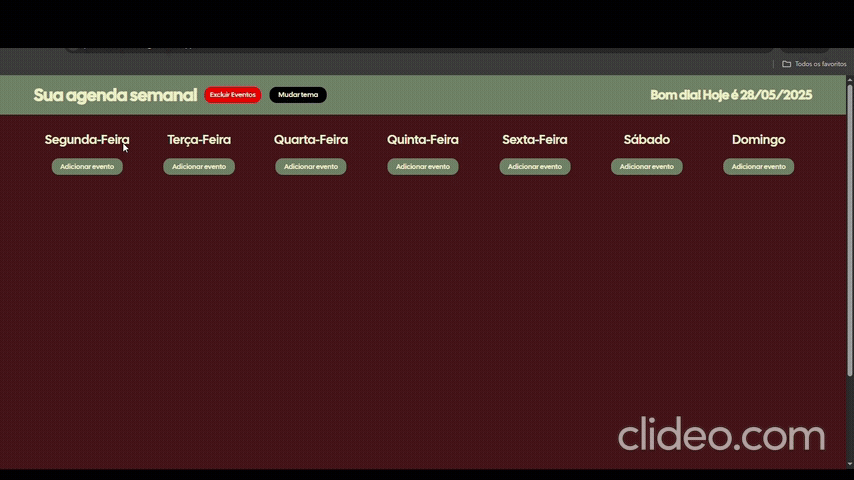
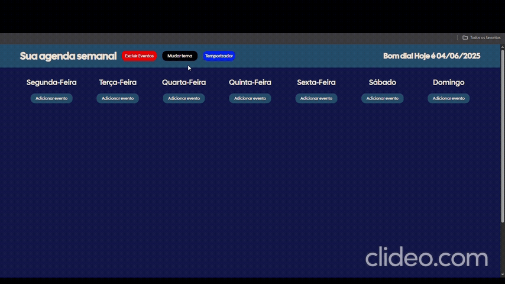

### 👋 Olá, esse é o meu projeto de <strong style = "color: green">Planner Semanal!</strong>

### 📍 <strong>Objetivos</strong> do Projeto
<ul>
    <li>Otimizar o seu dia a dia, com uma semana planejada tudo flui bem.</li>
    <li>Evitar o esquecimento de atividades importantes.</li>
    <li>Organizar a sua rotina e ter mais produtividade.</li>
    <li>Testar minhas habilidades em JS, HTML e CSS puros.</li>
</ul>

### ⚙ <strong>Funcionalidades</strong> do Projeto
<ul>
    <li>Utilização da <strong>API Web e do Local Storage para armazenar os dados localmente.</strong></li>
    <li>Sistema utilizando <strong>New Date que mostra a data atual e da uma saudação dependendo do horário que o usuário entra no site (Bom dia,Boa tarde,Boa noite e Boa Madrugada).</strong></li>
    <li>Função de <strong>excluir todos os eventos.</strong></li>
    <li>Função para <strong>excluir um evento específico.</strong></li>
    <li>Função para <strong>editar um evento.</strong></li>
    <li>Verificação de <strong>título igual e ordenação por hora.</strong></li>
    <li>Responsividade para <strong>todos os dispositivos.</strong></li>
    <li>Mudança de tema <strong>com um botão (Default Theme, Purple Theme e Dark Theme)</strong></li>
    <li><strong>O tema continua mesmo atualizando a página</strong></li>
</ul>

### 📺 Uma pequena demonstração do Projeto

### ⚙ Nova atualização (Janela de temporizador)

<ul>
    <li>Temporizador com tempos - <strong>Rápido(5min), Médio(15min), Longo(30min).</strong></li>
    <li>Quando você muda o tema na página principal <strong>ele também muda na página do timer.</strong></li>
    <li>Música tema no site e <strong>botão com funcionalidade de pausar e despausar a música.</strong></li>
    <li>Botão com <strong>função de Pausar e Continuar tempo.</strong></li>
</ul>

### 💻 Tecnologias Utilizadas

